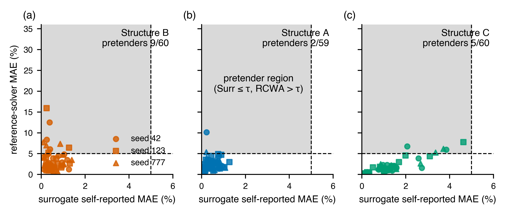

# Reliability of Physics-Transferred Neural Surrogates in Gradient-Based Inverse Metasurface Design

**A pre-specified reference-solver audit.** Code, frozen protocol, per-run artifacts and the evidence
files behind every number in the paper. Preprint: arXiv (v1, September 2026; identifier to follow) — [PDF in this repository](paper/preprint/main.pdf).
Archive: Zenodo deposit in preparation. Companion (the audited pipeline): [PBTL-MIM](https://github.com/BigMountain87/PBTL-MIM),
Choi, Kim & Kang, *Photonics Nanostruct. Fundam. Appl.* 72(B) 101617 (2026).

## What was audited, in one paragraph

A neural surrogate that predicts absorption spectra to 1.7–2.1 % test MAE is used as the forward model
of a gradient-based inverse-design loop. For every design the loop commits to, the rigorous
coupled-wave reference solver is called once. A **pretender** is a design the surrogate certifies
(surrogate MAE ≤ 5 %) but the solver rejects (reference MAE > 5 %). On the published pipeline, three
structures × three training seeds: **16 of 179 committed designs are pretenders (8.9 %)**; every one of
the 179 passes the surrogate's own check. Three controls (from-scratch training, feasibility-constrained
search, budget-matched random search) show none of the usual suspects is necessary. The identical
protocol on the release this pipeline superseded gives **95 of 179 (53.1 %)**, so such a reliability
claim belongs to a release, not to a method. A fourth structure audited out of sample gives 4 of 50.



## Reproduce the headline numbers in one minute (CPU, no PyTorch)

```bash
pip install numpy scipy matplotlib
# every number printed in the paper, checked against the JSON artifacts -> "check_manuscript: PASS"
python3 scripts/check_manuscript_v10.py paper/manuscript_v11.md --results results_pub
# pooled and per-structure pretender counts with Wilson intervals (rewrites results_pub/pooled_v8.json
# and mechanism_v8.json in place; deterministic — only a descriptive string differs)
python3 src_v8/make_evidence_json.py results_pub
# Figures 2-7 and S1-S2 from the artifacts, no recomputation (Figure 1 is a hand-drawn schematic)
INVERSETL_RESULTS_DIR=results_pub INVERSETL_FIGURES_DIR=figures_regen python3 scripts/make_figures_v9.py
```

The clustered intervals and the multi-seed statistics of Section 3.4 are produced by
`src_v8/stats_supplement_v9.py --results results_pub` and the control analyses by
`scripts/control_analysis_v10.py --seeds 42,123,777`; every JSON they write is already in
`results_pub/`.

## Re-run the audit (GPU)

The `scripts/run_*.sh` drivers are the resume-safe GPU-host runs behind each stage; they resolve
paths relative to the repository and take the interpreter from `PY` (default `python3`, needs
torch and torcwa 0.1.4.2).

Stages, one structure-agnostic codebase (`src_v8/`): `selfcheck.py` → `finetune.py` (seeds 42/123/777)
→ `inverse.py` (8 restarts per target) → `rcwa_validate.py` (reference solver, per-design cache) →
`reliability.py` → controls → analysis. Inputs are shipped: the datasets in `upstream_inputs_pub/` (printed pipeline) and
`upstream_inputs_v8/` (as-submitted release), the TMM-pretrained checkpoints in `archived_inputs/pub/`
and `upstream_inputs_v8/results/`, each hashed in `results_pub/INPUTS_MANIFEST.txt` (paths relative to
the repository root) and `results_v8/INPUTS_MANIFEST.txt` (its six as-submitted entries are relative to
`upstream_inputs_v8/`; the printed-pipeline entries it repeats are repository-relative).
Set `INVERSETL_PROFILE=pub` and `INVERSETL_UPSTREAM_ROOT=upstream_inputs_pub`. One RTX 4070 Ti SUPER: reference
solves take 103–4595 s per committed geometry at the adaptive Fourier order; the full pub arm is
~60 GPU-h.

## Layout

| path | contents |
|---|---|
| `docs/v8_protocol.md` | the protocol frozen 2026-06-10, with the dated amendments of §2.7 |
| `docs/structure_D_prespecification.md` | the recorded prediction for the out-of-sample structure |
| `docs/PROGRESS.md` | task-by-task execution record (Korean; a few internal notes are omitted from this public copy) |
| `docs/review_full_scope_codex_v11/`, `docs/review_iter*` | AI-assisted review transcripts (Codex/Claude), kept as a historical record: each report addresses the snapshot named in its header, and every item it raises was resolved in a later task of `docs/PROGRESS.md` |
| `docs/notes_rcwa_grid_truncation_v11.md` | reference-solver fidelity: raster and Fourier-order limits, with measurements |
| `paper/` | manuscript and supplement (Markdown source of truth), journal build (`mlst/`), preprint build (`preprint/`) |
| `results_pub/` | printed-pipeline arm: per-run artifacts, oracle cache, aggregated evidence JSON, `n50/`, `grid_delta/` |
| `results_v8/` | as-submitted arm (the two-arm comparison of §3.10) |
| `src_v8/upstream_cb486b5/`, `src_v8/upstream_920b1bd/` | the two vendored solver trees, bit-exact to the audited commits |

## Licence

Code: MIT (`LICENSE`). Data, checkpoints, results and figures: CC BY 4.0 (`LICENSE-DATA`). The raw datasets of the
companion paper keep the licence of [PBTL-MIM](https://github.com/BigMountain87/PBTL-MIM).

## Citation

Choi S.-B., Choi J.-M., Kim J., Kang C.-M. *Reliability of physics-transferred neural surrogates in
gradient-based inverse metasurface design: a pre-specified reference-solver audit.* arXiv preprint (2026).
